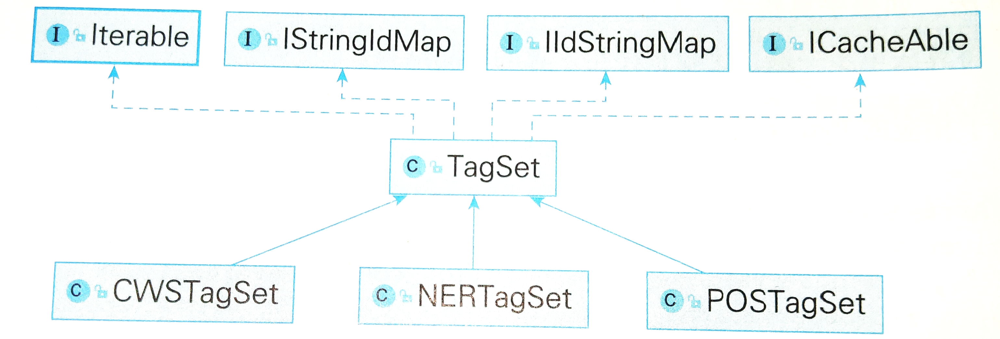

# 序列标注问题
指的是，给定一个序列$x=x_1x_2...x_n$ 找到与之对应的标签$y=y_1y_2...y_n$ 的问题。$y_i$的所有取值成为**标注集**
## 序列标注与中文分词
中文分词也可以转换为序列标注问题。常见的标注集为{B,M,E,S},即{begin, middle, end, single}。分词问题可以用以下方式解决f:
```
参　观　了　北　京　天　安　门
Ｂ　Ｅ　Ｓ　Ｂ　Ｅ　Ｂ　Ｍ　Ｅ 
```
最后，将BE之间的字符合并成一个单词，将S作为单字词语

## 序列标注与词性标注
x是单词序列，y是词性序列。常用的标注集是**863标注集**和**北大标注集**
```
 参观    了      北京    天安门
(动词) (助词)   (地名)   (地名)
```

## 序列标注与命名实体识别
借鉴词性标注的思路，x是**单词序列**，y是标注集。例如，地名使用`B/M/E/S-地名`来标注，不构成实体的单词统一标注成O(outside)
```
参观  了     北京     天安门
(O)  (O)  (B-地名)  (E-地名)
```

# 隐马尔科夫模型
```python
import numpy as np
from pyhanlp import *
from jpype import JArray, JFloat, JInt

to_str = JClass('java.util.Arrays').toString

# 状态
states = ('Healthy', 'Fever')
# 初始状态矩阵 pi
start_probability = {'Healthy': 0.6, 'Fever': 0.4}
# 状态转移矩阵
transition_probability = {
    'Healthy': {'Healthy': 0.7, 'Fever': 0.3},
    'Fever': {'Healthy': 0.4, 'Fever': 0.6},
}
# 发射概率矩阵
emission_probability = {
    'Healthy': {'normal': 0.5, 'cold': 0.4, 'dizzy': 0.1},
    'Fever': {'normal': 0.1, 'cold': 0.3, 'dizzy': 0.6},
}
# 观测状态
observations = ('normal', 'cold', 'dizzy')


# 将一个序列编号，并提供两个字典，方便两个方向的检索
def generate_index_map(lables):
    index_label = {}
    label_index = {}
    i = 0
    for l in lables:
        index_label[i] = l
        label_index[l] = i
        i += 1
    return label_index, index_label

# states和他们的index之间一一对应(statue <-----> index)
states_label_index, states_index_label = generate_index_map(states)
observations_label_index, observations_index_label = generate_index_map(observations)


# 将observation中的元素转换为对应的index
def convert_observations_to_index(observations, label_index):
    list = []
    for o in observations:
        list.append(label_index[o])
    return list


def convert_map_to_vector(map, label_index):
    v = np.empty(len(map), dtype=float)
    for e in map:
        v[label_index[e]] = map[e]
    return JArray(JFloat, v.ndim)(v.tolist())  # 将numpy数组转为Java数组


# 将map里面的元素转换成数组的形式， 返回的数据的维度是(len(label_index1), len(label_index2));label_index1,2分别表示x和y的label对应的index
def convert_map_to_matrix(map, label_index1, label_index2):
    m = np.empty((len(label_index1), len(label_index2)), dtype=float)
    for line in map:
        for col in map[line]:
            m[label_index1[line]][label_index2[col]] = map[line][col]
    return JArray(JFloat, m.ndim)(m.tolist())


# 状态转移矩阵，
A = convert_map_to_matrix(transition_probability, states_label_index, states_label_index)
# 发射概率
B = convert_map_to_matrix(emission_probability, states_label_index, observations_label_index)
# 将observations中的元素转换成index
observations_index = convert_observations_to_index(observations, observations_label_index)
# 初始概率， 将初始概率转换成向量
pi = convert_map_to_vector(start_probability, states_label_index)


FirstOrderHiddenMarkovModel = JClass('com.hankcs.hanlp.model.hmm.FirstOrderHiddenMarkovModel')
given_model = FirstOrderHiddenMarkovModel(pi, A, B)

# 生成样本
for O, S in given_model.generate(3, 5, 2):
    print(" ".join((observations_index_label[o] + '/' + states_index_label[s]) for o, s in zip(O, S)))

# 用样本训练马尔可夫模型
trained_model = FirstOrderHiddenMarkovModel()
trained_model.train(given_model.generate(3, 10, 100000))

#### 计算模型的相似度
assert trained_model.similar(given_model)
trained_model.unLog()  # 将对数形式的概率还原回来

pred = JArray(JInt, 1)([0, 0, 0])
prob = given_model.predict(observations_index, pred)
print(" ".join((observations_index_label[o] + '/' + states_index_label[s]) for o, s in
               zip(observations_index, pred)) + " {:.3f}".format(np.math.exp(prob)))
```

# HMM 用于中文分词
## 标注集
标签(B,M,E,S)到整型的映射


## 字符映射
Vocabulary, 字符（或单词）到整型的映射，使用字典树

## 语料转换

## 训练
model.train()

案例：
```python
# model的引用
def train(corpus, model):
    segmenter = HMMSegmenter(model)
    segmenter.train(corpus)
#     print(segmenter.segment('商品和服务'))
    return segmenter.toSegment()


def evaluate(segment):
    result = CWSEvaluator.evaluate(segment, msr_test, msr_output, msr_gold, msr_dict)

# msr_train=E:/Workspaces/Python/Envs/NLP/Lib/site-packages/pyhanlp/static/data/test/icwb2-data\\training\\msr_training.utf8
segment = train(msr_train, FirstOrderHiddenMarkovModel())
print(evaluate(segment))
# P:78.49 R:80.38 F1:79.42 OOV-R:41.11 IV-R:81.44
```

用于分词的语料库形式如下：
```
台灣　大學　學生　，
尤其　是　上　他　的　課　的　學生　真　是　可愛　。
在　他　教書　的　四　個　月　中　，
碰上　一　個　月　放　寒假　，
吳　先生　問　學生　願意　不　放　寒假　嗎　？
```

# 二阶隐马尔可夫模型
二阶的含义是，计算状态转移矩阵时，每个状态的概率都要考虑到前面两个状态。与以节隐马尔可夫模型非常类似。
```python
segment = train(msr_train, SecondOrderHiddenMarkovModel())
evaluate(segment)
# P:78.34 R:80.01 F1:79.16 OOV-R:42.06 IV-R:81.04
```